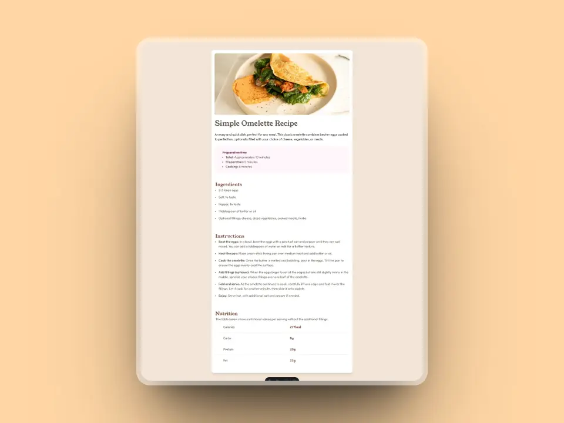
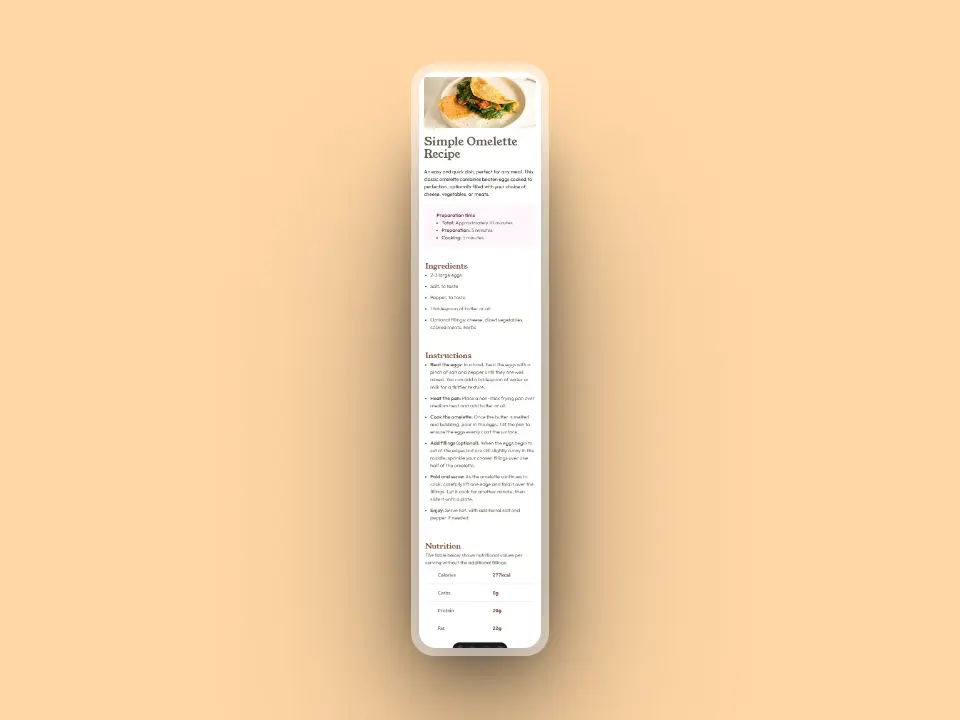

# Frontend Mentor - Recipe page solution

This is a solution to the [Recipe page challenge on Frontend Mentor](https://www.frontendmentor.io/challenges/recipe-page-KiTsR8QQKm). Frontend Mentor challenges help you improve your coding skills by building realistic projects. 

## Table of contents

- [Overview](#overview)
  - [The challenge](#the-challenge)
  - [Screenshot](#screenshot)
  - [Links](#links)
- [My process](#my-process)
  - [Built with](#built-with)  
- [Author](#author)
- [Acknowledgments](#acknowledgments)

## Overview

### Screenshot

### Links

- Solution URL: [Frontend Mentor](https://www.frontendmentor.io/challenges/recipe-page-KiTsR8QQKm/hub)
- Live Site URL: [Netlify](https://cheerful-gumption-ef9c1c.netlify.app/)

## My process

### Built with

- Semantic HTML5 markup
- CSS custom properties
- Flexbox 
- [Astro](https://astro.build/) 
- [TailwindCss](https://tailwindcss.com/) - For styles

## Author

- Github - [emanuel-ra](https://github.com/emanuel-ra/)
- Frontend Mentor - [@emanuel-ra](https://www.frontendmentor.io/profile/emanuel-ra)
- Linkedin - [@emanuelramirezabarca](https://www.linkedin.com/in/emanuelramirezabarca/)